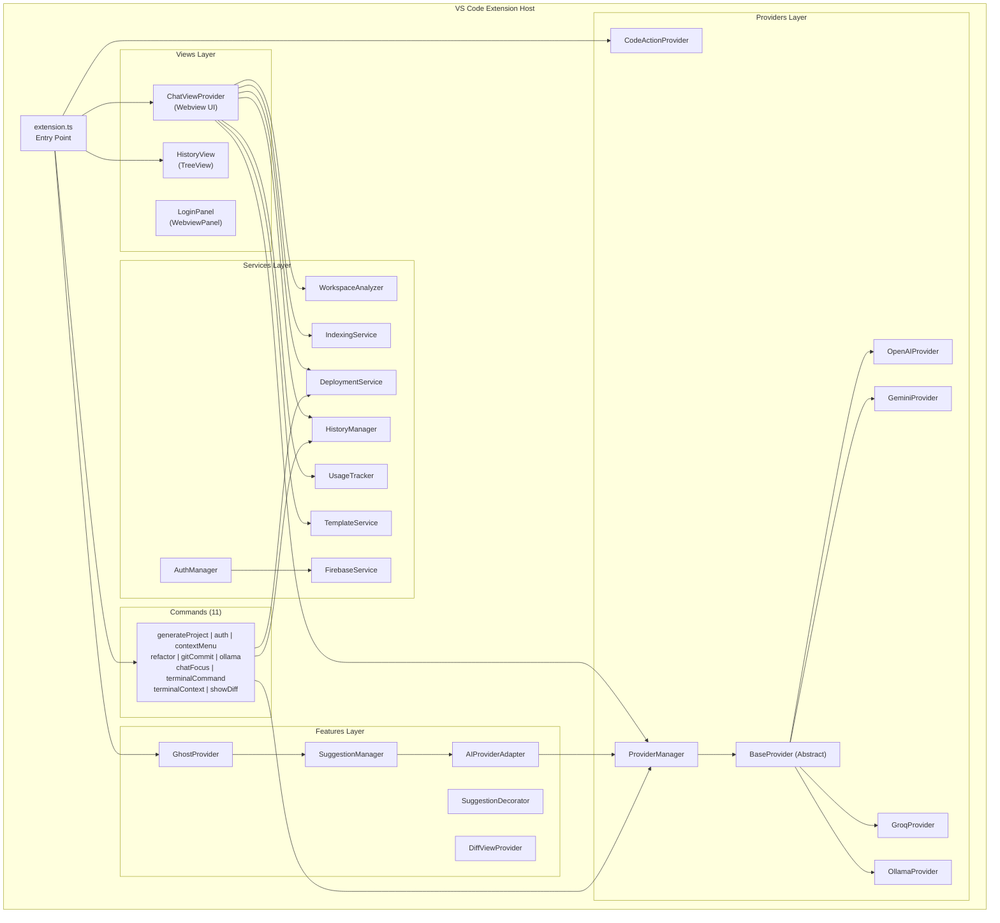
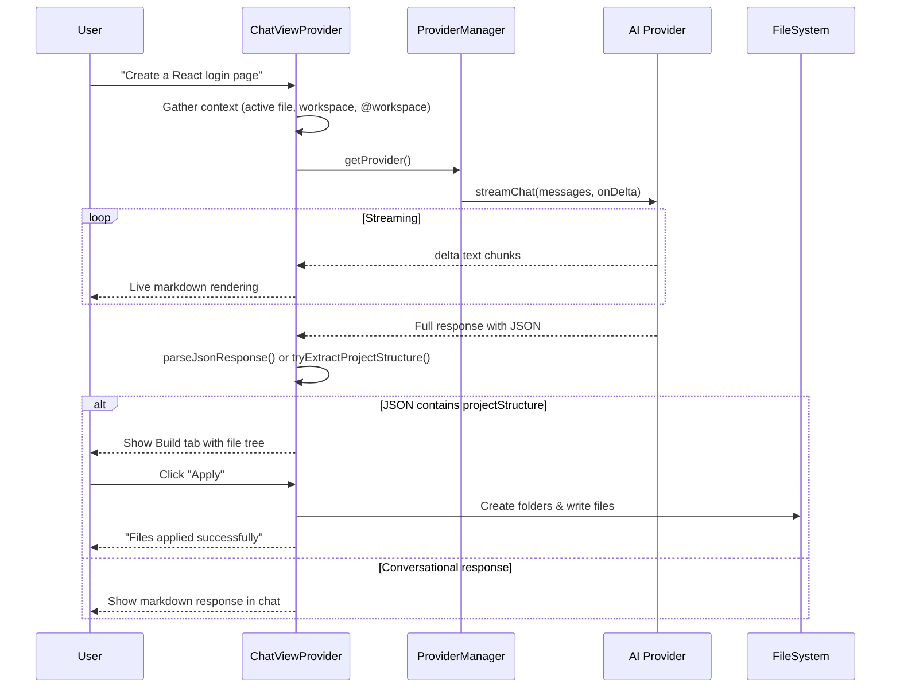
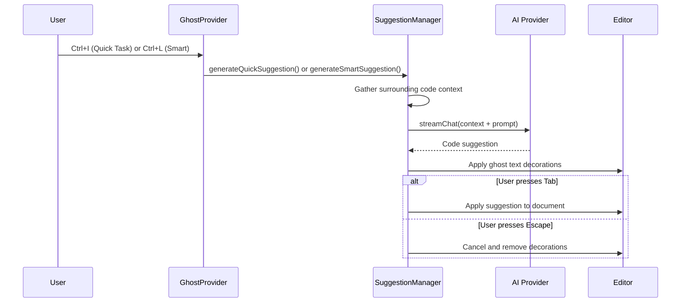
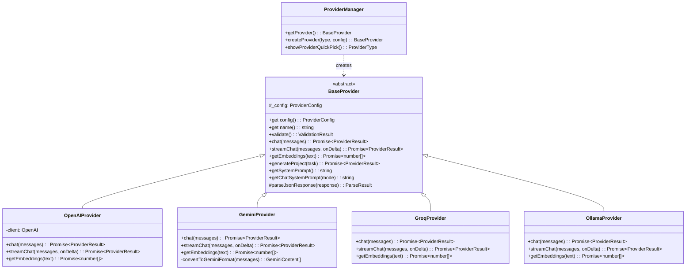
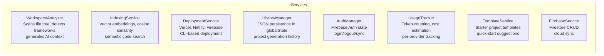
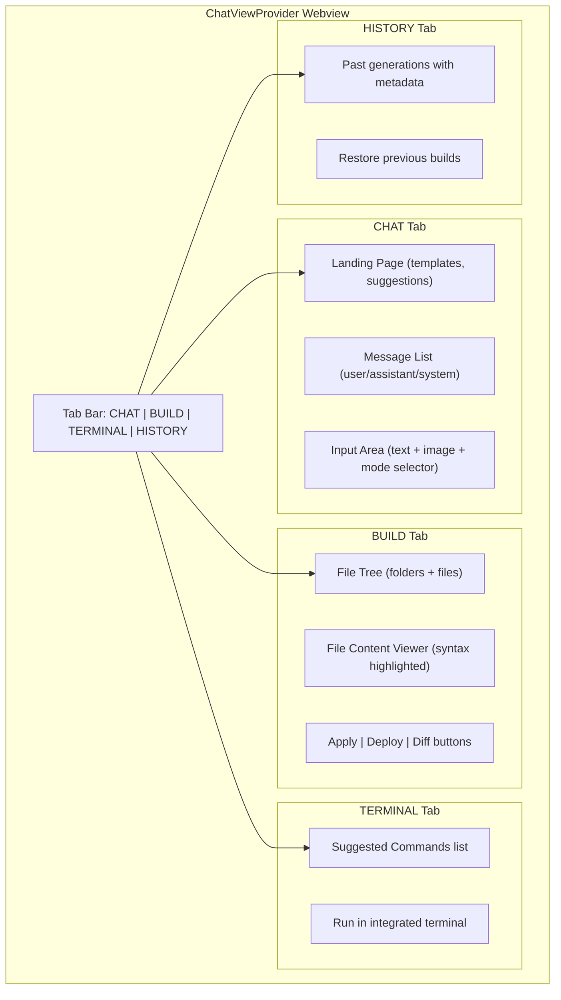
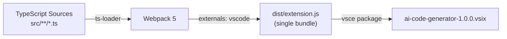
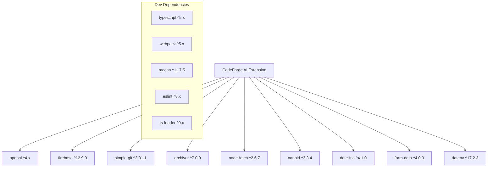

# CodeForge AI — Technical Documentation

> **Version:** 1.0.0 | **Authors:** Amar Pradhan & Biswajit Dash | **Platform:** VS Code Extension

---

## 1. Overview

CodeForge AI is a VS Code extension that generates complete project structures and code from natural language prompts. It supports multiple AI providers, inline code suggestions (ghost text), context-aware editing, deployment, and workspace indexing.

---

## 2. Tech Stack

| Layer          | Technology                                     | Purpose                                    |
| -------------- | ---------------------------------------------- | ------------------------------------------ |
| **Runtime**    | VS Code Extension Host (Node.js)               | Extension execution environment            |
| **Language**   | TypeScript 5.x                                 | Primary development language               |
| **Bundler**    | Webpack 5.x                                    | Bundles extension into `dist/extension.js` |
| **Testing**    | Mocha + VS Code Test Electron                  | Unit and integration testing               |
| **Linting**    | ESLint 8.x + TypeScript ESLint                 | Code quality enforcement                   |
| **AI — Cloud** | OpenAI SDK 4.x, Gemini REST API, Groq REST API | Cloud AI providers                         |
| **AI — Local** | Ollama REST API                                | Local model inference                      |
| **Auth**       | Firebase 12.x (Auth + Firestore)               | User authentication and cloud sync         |
| **Deployment** | Vercel CLI, Netlify CLI, Firebase CLI          | One-click project deployment               |
| **Git**        | simple-git 3.x                                 | Git commit message generation              |
| **File Utils** | archiver 7.x, node-fetch 2.x, nanoid 3.x       | ZIP creation, HTTP, unique IDs             |
| **Date**       | date-fns 4.x                                   | Date formatting                            |

---

## 3. High-Level Architecture



---

## 4. Project Structure

```
src/
├── extension.ts                    # Entry point — activate/deactivate
├── commands/                       # 11 command handlers
│   ├── generateProject.ts          # Core project generation command
│   ├── auth.ts                     # Firebase login
│   ├── contextMenu.ts              # Right-click: explain/fix/improve code
│   ├── refactor.ts                 # Refactor, optimize, document, explain
│   ├── gitCommit.ts                # AI-generated commit messages
│   ├── ollama.ts                   # Manage local Ollama models
│   ├── chatFocus.ts                # Chat UI focus and suggestion accept/reject
│   ├── terminalCommand.ts          # Generate terminal commands from natural language
│   ├── terminalContext.ts          # Terminal right-click: fix/explain commands
│   ├── showDiff.ts                 # Show diff view for suggestions
│   └── index.ts                    # Barrel export
├── providers/                      # AI provider abstraction
│   ├── baseProvider.ts             # Abstract base class (system prompts, JSON parsing)
│   ├── openaiProvider.ts           # OpenAI GPT-4o/mini implementation
│   ├── geminiProvider.ts           # Google Gemini 1.5/2.0 implementation
│   ├── groqProvider.ts             # Groq Llama/Mixtral implementation
│   ├── ollamaProvider.ts           # Local Ollama model implementation
│   ├── providerManager.ts          # Factory: creates provider from settings
│   ├── codeActionProvider.ts       # VS Code CodeAction provider (lightbulb fixes)
│   └── index.ts                    # Barrel export
├── services/                       # Business logic services
│   ├── workspaceAnalyzer.ts        # Analyzes workspace structure for AI context
│   ├── indexingService.ts          # Semantic vector indexing with embeddings
│   ├── deploymentService.ts        # Deploy to Vercel/Netlify/Firebase
│   ├── historyManager.ts           # Persist project generation history
│   ├── authManager.ts              # Firebase auth state management
│   ├── firebaseService.ts          # Firebase SDK wrapper
│   ├── usageTracker.ts             # Track API token usage and costs
│   └── templateService.ts          # Project template suggestions
├── features/                       # Feature-specific modules
│   ├── ghost/                      # Inline code suggestions (ghost text)
│   │   ├── ghostProvider.ts        # Main provider, registers commands
│   │   ├── suggestionManager.ts    # Generates and manages inline suggestions
│   │   ├── suggestionDecorator.ts  # Renders ghost text decorations
│   │   ├── aiProviderAdapter.ts    # Adapts BaseProvider for ghost text
│   │   └── types.ts                # Ghost-specific types
│   └── diff/
│       └── diffViewProvider.ts     # TextDocumentContentProvider for diffs
├── types/                          # Shared TypeScript types
│   ├── provider.ts                 # ProviderType, ProviderConfig, ChatMessage, ProviderResult, PROVIDER_INFO
│   ├── project.ts                  # ProjectFile, ProjectStructure, AIResponse
│   └── index.ts                    # Barrel export
├── utils/                          # Utility functions
│   ├── fileSystem.ts               # FileSystemUtils: safe file creation, workspace root
│   ├── testGenerator.ts            # AI-powered test generation
│   └── index.ts                    # Barrel export
├── views/                          # UI components
│   ├── chatView.ts                 # Main Webview UI (1716 lines — chat, build, terminal, history)
│   ├── historyView.ts              # TreeDataProvider for project generation history
│   └── loginPanel.ts               # Firebase auth WebviewPanel
└── test/
    └── suite/
        └── extension.test.ts       # Mocha tests (14 test cases)
```

---

## 5. Core Data Flow

### 5.1 Project Generation Flow



### 5.2 Ghost Text (Inline Suggestions) Flow



---

## 6. Provider Architecture



### Provider Comparison

| Provider   | API Style    | Auth                | Streaming | Embeddings                  | Free Tier       |
| ---------- | ------------ | ------------------- | --------- | --------------------------- | --------------- |
| **OpenAI** | OpenAI SDK   | API Key (header)    | ✅ SSE    | ✅ `text-embedding-3-small` | ❌              |
| **Gemini** | REST + fetch | API Key (URL param) | ✅ SSE    | ✅ `text-embedding-004`     | ✅              |
| **Groq**   | REST + fetch | Bearer token        | ✅ SSE    | ❌ (empty array)            | ✅              |
| **Ollama** | REST + fetch | None (local)        | ✅ NDJSON | ✅ Native                   | ✅ (100% local) |

---

## 7. Services Architecture



| Service               | Key Methods                                                                               | Storage                                |
| --------------------- | ----------------------------------------------------------------------------------------- | -------------------------------------- |
| **WorkspaceAnalyzer** | `analyzeWorkspace()`, `buildFileTree()`, `detectFrameworks()`, `formatContextForPrompt()` | In-memory                              |
| **IndexingService**   | `indexWorkspace()`, `search()`, `chunkFile()`, `cosineSimilarity()`                       | `.ai-code-generator/vector-index.json` |
| **DeploymentService** | `deploy()`, `deployToVercel()`, `deployToNetlify()`, `deployToFirebase()`                 | None                                   |
| **HistoryManager**    | `addEntry()`, `getHistory()`, `deleteEntry()`                                             | VS Code `globalState`                  |
| **UsageTracker**      | `trackUsage()`, `getUsageSummary()`, `estimateCost()`                                     | VS Code `globalState`                  |
| **AuthManager**       | `login()`, `logout()`, `getCurrentUser()`                                                 | Firebase Auth                          |
| **TemplateService**   | `getTemplates()`, `getTemplateById()`                                                     | Static in-memory                       |

---

## 8. Chat Modes

The extension supports 3 distinct modes via the system prompt:

| Mode                | Behavior                                  | JSON Output                                |
| ------------------- | ----------------------------------------- | ------------------------------------------ |
| **Agent** (default) | Builds projects, generates files          | ✅ Required for create/build/make requests |
| **Debug**           | Analyzes errors, fixes code               | ✅ Returns corrected files                 |
| **Planning**        | Discusses architecture, answers questions | ❌ Conversational only                     |

---

## 9. Command Registry

| Command ID                                     | Trigger                    | Handler                 |
| ---------------------------------------------- | -------------------------- | ----------------------- |
| `ai-code-generator.generateProject`            | Command Palette            | `generateProject.ts`    |
| `ai-code-generator.selectModel`                | Command Palette            | `generateProject.ts`    |
| `ai-code-generator.manageOllama`               | Command Palette            | `ollama.ts`             |
| `ai-code-generator.refactorSelection`          | Command / Context Menu     | `refactor.ts`           |
| `ai-code-generator.addDocumentation`           | Command / Context Menu     | `refactor.ts`           |
| `ai-code-generator.optimizeCode`               | Command / Context Menu     | `refactor.ts`           |
| `ai-code-generator.explainCode`                | Command / Context Menu     | `refactor.ts`           |
| `ai-code-generator.explainCodeContext`         | Right-click → CodeForge AI | `contextMenu.ts`        |
| `ai-code-generator.fixCodeContext`             | Right-click → CodeForge AI | `contextMenu.ts`        |
| `ai-code-generator.improveCodeContext`         | Right-click → CodeForge AI | `contextMenu.ts`        |
| `ai-code-generator.addToContext`               | Right-click → CodeForge AI | `contextMenu.ts`        |
| `ai-code-generator.generateCommitMessage`      | Command Palette            | `gitCommit.ts`          |
| `ai-code-generator.generateTerminalCommand`    | Command Palette            | `terminalCommand.ts`    |
| `ai-code-generator.focusChatInput`             | `Ctrl+Shift+A`             | `chatFocus.ts`          |
| `ai-code-generator.newChat`                    | `Ctrl+Shift+N`             | `chatFocus.ts`          |
| `ai-code-generator.indexWorkspace`             | Command Palette            | `extension.ts` (inline) |
| `ai-code-generator.ghost.promptCodeSuggestion` | `Ctrl+I`                   | `ghostProvider.ts`      |
| `ai-code-generator.ghost.generateSuggestions`  | `Ctrl+L`                   | `ghostProvider.ts`      |

---

## 10. Webview UI Architecture

The `ChatViewProvider` renders a single-page Webview with 4 tabs:



### Message Protocol (Webview ↔ Extension)

| Direction           | Message Type      | Purpose                            |
| ------------------- | ----------------- | ---------------------------------- |
| Webview → Extension | `sendMessage`     | User sends chat message            |
| Webview → Extension | `applyProject`    | Apply generated files to workspace |
| Webview → Extension | `deployProject`   | Trigger deployment                 |
| Webview → Extension | `runCommand`      | Execute terminal command           |
| Webview → Extension | `diffFile`        | Show diff for a file               |
| Extension → Webview | `addMessage`      | Add chat message                   |
| Extension → Webview | `updateDelta`     | Stream token delta                 |
| Extension → Webview | `showBuild`       | Display project structure          |
| Extension → Webview | `showCommands`    | Show suggested commands            |
| Extension → Webview | `setLoading`      | Toggle loading state               |
| Extension → Webview | `finishStreaming` | End streaming response             |

---

## 11. Build & Bundle Pipeline



| Config        | Value                           |
| ------------- | ------------------------------- |
| **Target**    | `node` (VS Code extension host) |
| **Entry**     | `src/extension.ts`              |
| **Output**    | `dist/extension.js`             |
| **Externals** | `vscode` (provided by host)     |
| **Mode**      | `production` (for release)      |
| **Loader**    | `ts-loader`                     |

---

## 12. Configuration Schema

All settings are under the `aiCodeGenerator.*` namespace:

| Setting                          | Type   | Default                   | Description        |
| -------------------------------- | ------ | ------------------------- | ------------------ |
| `aiCodeGenerator.provider`       | enum   | `gemini`                  | Active AI provider |
| `aiCodeGenerator.openai.apiKey`  | string | —                         | OpenAI API key     |
| `aiCodeGenerator.openai.model`   | enum   | `gpt-4o-mini`             | OpenAI model       |
| `aiCodeGenerator.gemini.apiKey`  | string | —                         | Gemini API key     |
| `aiCodeGenerator.gemini.model`   | enum   | `gemini-2.0-flash`        | Gemini model       |
| `aiCodeGenerator.groq.apiKey`    | string | —                         | Groq API key       |
| `aiCodeGenerator.groq.model`     | enum   | `llama-3.3-70b-versatile` | Groq model         |
| `aiCodeGenerator.ollama.baseUrl` | string | `http://localhost:11434`  | Ollama server URL  |
| `aiCodeGenerator.ollama.model`   | string | `codellama`               | Ollama model name  |

---

## 13. Security Model

| Concern             | Approach                                                                            |
| ------------------- | ----------------------------------------------------------------------------------- |
| **API Keys**        | Stored in VS Code settings (encrypted by OS keychain on supported platforms)        |
| **Firebase Config** | Public project identifiers embedded in source (standard for client-side Firebase)   |
| **Webview CSP**     | Content Security Policy restricts scripts to nonces                                 |
| **Network**         | All API calls use HTTPS; Ollama uses local HTTP only                                |
| **File System**     | Files written only to workspace root; path traversal prevented by `FileSystemUtils` |

---

## 14. Testing

**Framework:** Mocha + `@vscode/test-electron`

| Test Suite            | Tests | Coverage                                                                        |
| --------------------- | ----- | ------------------------------------------------------------------------------- |
| Extension Activation  | 3     | Extension presence, exports, command registration                               |
| JSON Response Parsing | 6     | Valid JSON, markdown-wrapped, missing fields, invalid, auto-folders, extraction |
| Provider Validation   | 5     | API key requirements per provider                                               |

**Run tests:**

```bash
npm run compile-tests
npm test
```

---

## 15. Deployment Targets

The `DeploymentService` supports one-click deployment to:

| Platform     | Method                                  | Requirements                   |
| ------------ | --------------------------------------- | ------------------------------ |
| **Vercel**   | CLI (`vercel --yes --prod`)             | `vercel` CLI installed + token |
| **Netlify**  | REST API (`/api/v1/sites/{id}/deploys`) | API token + site ID            |
| **Firebase** | CLI (`firebase deploy`)                 | `firebase-tools` CLI + login   |

---

## 16. Dependencies Graph


