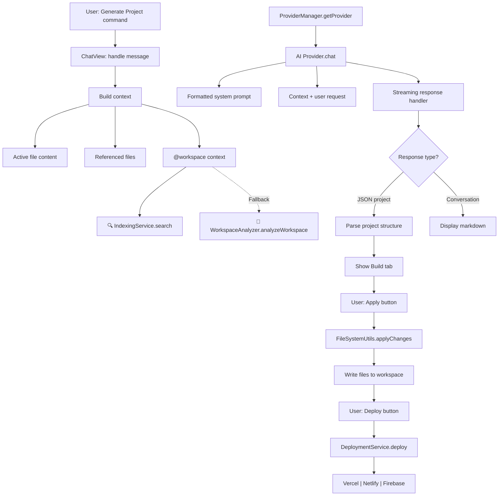
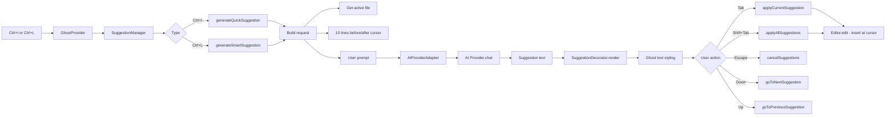
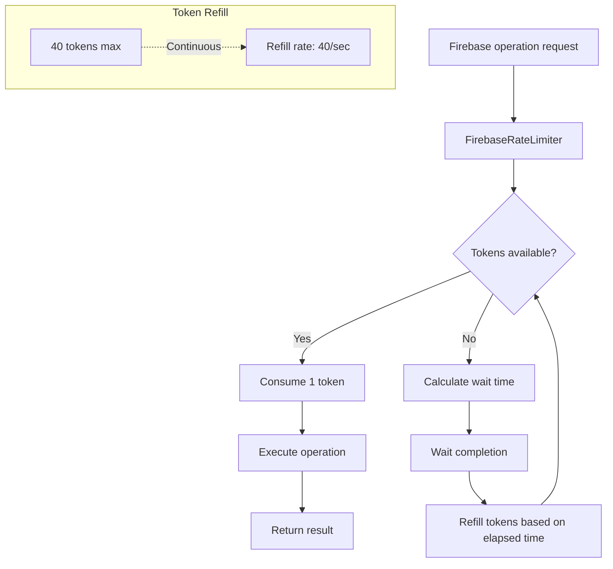

# AI Code Generator - Technical Documentation

## Table of Contents
1. [Architecture Overview](#architecture-overview)
2. [System Components](#system-components)
3. [Extension Lifecycle](#extension-lifecycle)
4. [AI Provider Architecture](#ai-provider-architecture)
5. [Firebase Integration](#firebase-integration)
6. [Workspace Analysis](#workspace-analysis)
7. [Ghost Text Feature](#ghost-text-feature)
8. [Chat Webview Architecture](#chat-webview-architecture)
9. [Deployment Service](#deployment-service)
10. [Vector Indexing Service](#vector-indexing-service)
11. [Configuration Schema](#configuration-schema)
12. [Data Flow Diagrams](#data-flow-diagrams)
13. [Security Implementation](#security-implementation)
14. [Build Process](#build-process)
15. [API Reference](#api-reference)

---

## Architecture Overview

The AI Code Generator is a VS Code extension that provides AI-powered code generation using multiple providers. The extension follows a modular architecture with clear separation of concerns.

### High-Level Architecture

```
┌─────────────────────────────────────────────────────────────────┐
│                         VS Code Extension Host                   │
├─────────────────────────────────────────────────────────────────┤
│                                                                   │
│  ┌──────────────┐  ┌──────────────┐  ┌──────────────┐          │
│  │ ChatView     │  │ GhostFeature │  │ CodeActions  │          │
│  │ (Webview)    │  │ (Inline)     │  │ (QuickFix)   │          │
│  └──────┬───────┘  └──────┬───────┘  └──────┬───────┘          │
│         │                  │                  │                  │
│         └──────────────────┼──────────────────┘                  │
│                            │                                     │
│                    ┌───────▼────────┐                           │
│                    │ ProviderManager │                           │
│                    └───────┬────────┘                           │
│                            │                                     │
│         ┌──────────────────┼──────────────────┐                 │
│         │                  │                  │                 │
│  ┌──────▼──────┐  ┌───────▼──────┐  ┌───────▼──────┐          │
│  │  OpenAI     │  │   Gemini    │  │   Groq      │          │
│  │  Provider   │  │   Provider  │  │   Provider  │          │
│  └─────────────┘  └─────────────┘  ┌─────────────┐          │
│                                              │                   │
│                                      ┌───────▼──────┐          │
│                                      │   Ollama     │          │
│                                      │   Provider   │          │
│                                      └──────────────┘          │
│                                                                   │
├─────────────────────────────────────────────────────────────────┤
│  Services: Firebase | WorkspaceAnalyzer | Deployment | Indexing │
├─────────────────────────────────────────────────────────────────┤
│  Features: DiffView | HistoryManager | TemplateService          │
└─────────────────────────────────────────────────────────────────┘
```

### Key Design Principles

1. **Provider Abstraction**: All AI providers implement [`BaseProvider`](src/providers/baseProvider.ts:7) for consistency
2. **Service Layer**: Network operations, authentication, and file I/O in dedicated services
3. **Event-driven**: Webview communication via message passing patterns
4. **State Management**: History, workspace context, and active suggestions tracked centrally
5. **Rate Limiting**: Token bucket algorithm for Firebase operations

---

## System Components

### Core Components

#### 1. Main Extension Entry ([`extension.ts`](src/extension.ts))

The main entry point initializes all providers, services, and features.

**Key initialization:**
```typescript
import { ChatViewProvider } from './views/chatView';
import { GhostProvider } from './features/ghost/ghostProvider';
import { AICodeActionProvider } from './providers/codeActionProvider';
```

**Activated providers:**
- [`OpenAIProvider`](src/providers/openaiProvider.ts:4)
- [`GeminiProvider`](src/providers/geminiProvider.ts:4)
- [`GroqProvider`](src/providers/groqProvider.ts:4)
- [`OllamaProvider`](src/providers/ollamaProvider.ts:4)

**Activated services:**
- [`FirebaseService`](src/services/firebaseService.ts:11)
- [`WorkspaceAnalyzer`](src/services/workspaceAnalyzer.ts:6)
- [`DeploymentService`](src/services/deploymentService.ts:16)
- [`IndexingService`](src/services/indexingService.ts:13)
- [`HistoryManager`](src/services/historyManager.ts)
- [`TemplateService`](src/services/templateService.ts)

#### 2. Type Definitions ([`src/types/`](src/types/))

**[`ProviderType`](src/types/provider.ts:6):** Union type for supported providers
```typescript
export type ProviderType = 'openai' | 'gemini' | 'groq' | 'ollama';
```

**[`ProviderConfig`](src/types/provider.ts:11):** Configuration interface
```typescript
export interface ProviderConfig {
    type: ProviderType;
    apiKey?: string;
    model: string;
    baseUrl?: string;
}
```

**[`ChatMessage`](src/types/provider.ts:21):** Message format for AI chat
```typescript
export interface ChatMessage {
    role: 'system' | 'user' | 'assistant';
    content: string;
    image?: string; // Optional base64 encoded image data
}
```

**[`ProviderResult`](src/types/provider.ts:31):** Result from AI provider
```typescript
export interface ProviderResult {
    success: boolean;
    projectStructure?: ProjectStructure;
    message?: string;
    error?: string;
    tokensUsed?: number;
}
```

---

## Extension Lifecycle

### Activation Sequence

```
1. activate() called
   ├─ Initialize Firebase service
   ├─ Register all providers
   ├─ Create ChatViewProvider
   ├─ Create GhostProvider
   ├─ Register CodeActionProvider
   ├─ Register 30+ commands
   └─ Return disposables

2. User interacts with commands
   ├─ AI commands → Provider Manager → AI Provider
   ├─ Ghost commands → Suggestion Manager → AI Provider
   └─ Code actions → AI Provider → Workspace edits

3. deactivate() called
   └─ Dispose all disposables
```

### Command Registration

The extension registers commands for:
- Project generation
- Provider selection
- History management
- Deployment operations
- Workspace analysis
- Ghost text operations
- Code actions/refactoring

Full command list in [`package.json`](package.json:81-358) under `contributes.commands`.

---

## AI Provider Architecture

### Base Provider Class ([`BaseProvider`](src/providers/baseProvider.ts:7))

All providers extend [`BaseProvider`](src/providers/baseProvider.ts:7) which defines the contract.

**Abstract methods:**
```typescript
abstract get name(): string;
abstract validate(): { valid: boolean; error?: string };
abstract chat(messages: ChatMessage[]): Promise<ProviderResult>;
abstract streamChat(messages: ChatMessage[], onDelta: (delta: string) => void): Promise<ProviderResult>;
abstract getEmbeddings(text: string): Promise<number[]>;
```

### OpenAI Provider ([`OpenAIProvider`](src/providers/openaiProvider.ts:4))

**Configuration:**
- Uses `openai` npm package v4.x
- API key from VS Code settings: `aiCodeGenerator.openai.apiKey`
- Models: `gpt-4o`, `gpt-4o-mini`, `gpt-4-turbo`, `gpt-3.5-turbo`
- Timeout: 120 seconds
- **Security note**: Uses `dangerouslyAllowBrowser: true` flag - requires proxy server for production

**Implementation highlights:**
```typescript
this.client = new OpenAI({
    apiKey: this.config.apiKey,
    dangerouslyAllowBrowser: true, // ⚠️ PRODUCTION BUG - needs proxy
    timeout: 120000
});
```

### Gemini Provider ([`GeminiProvider`](src/providers/geminiProvider.ts:4))

**Configuration:**
- Uses `generativelanguage.googleapis.com` REST API
- API key in URL query parameter per Google's documentation
- Models: `gemini-2.0-flash-exp`, `gemini-1.5-flash`, `gemini-1.5-pro`
- Timeout: 120 seconds

**Implementation highlights:**
```typescript
const url = `https://generativelanguage.googleapis.com/v1beta/models/${model}:generateContent?key=${apiKey}`;
const controller = new AbortController();
const timeoutId = setTimeout(() => controller.abort(), 120000);
```

### Groq Provider ([`GroqProvider`](src/providers/groqProvider.ts:4))

**Configuration:**
- Uses `api.groq.com` OpenAI-compatible endpoint
- Models: `llama-3.3-70b-versatile`, `llama-3.1-8b-instant`, `mixtral-8x7b-32768`
- Timeout: 120 seconds

### Ollama Provider ([`OllamaProvider`](src/providers/ollamaProvider.ts:4))

**Configuration:**
- Local inference at `http://localhost:11434/api/generate`
- Models: `codellama`, `deepseek-coder`, `llama3`, `mistral`
- No API key required
- Timeout: 120 seconds

**State tracking:**
- Uses `/api/tags` to list available models
- Supports streaming responses via `/api/generate` with `stream: true`

### Provider Manager

Coordinates provider instances and switches between them.

**Key methods:**
- `getProvider()`: Returns active provider instance
- `selectProvider(type: ProviderType)`: Switches active provider

---

## Firebase Integration

### Firebase Configuration ([`firebase/config.ts`](src/firebase/config.ts))

Configuration loaded from environment variables:

```typescript
export const firebaseConfig = {
    apiKey: process.env.FIREBASE_API_KEY,
    authDomain: process.env.FIREBASE_AUTH_DOMAIN,
    projectId: process.env.FIREBASE_PROJECT_ID,
    storageBucket: process.env.FIREBASE_STORAGE_BUCKET,
    messagingSenderId: process.env.FIREBASE_MESSAGING_SENDER_ID,
    appId: process.env.FIREBASE_APP_ID,
    measurementId: process.env.FIREBASE_MEASUREMENT_ID
};
```

### Firebase Service ([`FirebaseService`](src/services/firebaseService.ts:11))

**Features:**
- User authentication (signup, login)
- Profile management (get, save, update)
- Chat history persistence
- Workspace usage tracking

**Rate Limiting Implementation:**

Implements token bucket rate limiter to prevent Firebase quota exhaustion:

```typescript
class FirebaseRateLimiter {
    private tokens: number;
    private readonly maxTokens: number = 40;
    private readonly refillRate: number = 40; // tokens per second
    
    async waitForToken(): Promise<void> {
        const now = Date.now();
        const elapsed = (now - this.lastRefill) / 1000;
        this.tokens = Math.min(this.maxTokens, this.tokens + elapsed * this.refillRate);
        
        if (this.tokens < 1) {
            const waitTime = ((1 - this.tokens) / this.refillRate) * 1000;
            await new Promise(resolve => setTimeout(resolve, waitTime));
        }
        this.tokens -= 1;
    }
}
```

**Rate limiter applied to:**
- `signup()`: 40 ops/sec limit
- `getUserProfile()`: 40 ops/sec limit
- `login()`: 40 ops/sec limit
- `saveHistory()`: 40 ops/sec limit
- `getHistory()`: 40 ops/sec limit

---

## Workspace Analysis

### Workspace Analyzer Service ([`WorkspaceAnalyzer`](src/services/workspaceAnalyzer.ts:6))

Analyzes workspace structure to provide context to AI.

**Key features:**
- Recursive directory traversal
- File type filtering (TS, JS, Python, Java, Go, Rust, C, C++)
- Content summarization using AI embeddings
- Recent file detection
- Exported function/method detection for code files

**API methods:**
```typescript
static async analyzeWorkspace(depth: number = 3, verbose: boolean = false): Promise<WorkspaceContext>
static formatContextForPrompt(context: WorkspaceContext): string
```

**Workspace context structure:**
```typescript
interface WorkspaceContext {
    summary: string;              // AI-generated summary
    recentFiles: FileSnippet[];   // Recently modified files
    keyFiles: FileSnippet[];      // Important files detected
    totalFiles: number;
    lastModified: Date;
}

interface FileSnippet {
    path: string;
    content: string;
    language: string;
}
```

**Non-blocking implementation:**

Uses VS Code workspace API instead of blocking `fs` operations:

```typescript
// Before: fs.readdirSync(dirPath, { withFileTypes: true })
// After:
const dirUri = vscode.Uri.file(dirPath);
const entries = await vscode.workspace.fs.readDirectory(dirUri);
```

---

## Ghost Text Feature

### Architecture

```
┌──────────────┐
│ GhostProvider │
│  (Commands)  │
└──────┬───────┘
       │
┌──────▼────────┐
│SuggestionManager │
│  (Lifecycle)   │
└──────┬─────────┘
       │
       ├──► generateQuickSuggestion()  (Ctrl+I)
       │       └─ User prompt + context
       │
       ├──► generateSmartSuggestion()  (Ctrl+L)
       │       └─ Contextual analysis
       │
       ├──► applyCurrentSuggestion()   (Tab)
       │       └─ Insert at cursor
       │
       ├──► goToNextSuggestion()       (Down)
       ├──► goToPreviousSuggestion()   (Up)
       └──► cancelSuggestions()        (Escape)
```

### Components

#### 1. Ghost Provider ([`GhostProvider`](src/features/ghost/ghostProvider.ts:10))

Registers commands for inline code suggestions.

**Commands:**
- `ai-code-generator.ghost.promptCodeSuggestion` (Ctrl+I)
- `ai-code-generator.ghost.generateSuggestions` (Ctrl+L)
- `ai-code-generator.ghost.applyCurrentSuggestion` (Tab)
- `ai-code-generator.ghost.applyAllSuggestions` (Shift+Tab)
- `ai-code-generator.ghost.cancelSuggestions` (Escape)
- `ai-code-generator.ghost.goToNextSuggestion` (Down Arrow)
- `ai-code-generator.ghost.goToPreviousSuggestion` (Up Arrow)

#### 2. Suggestion Manager ([`SuggestionManager`](src/features/ghost/suggestionManager.ts:11))

Manages suggestion lifecycle: generate, display, navigate, apply.

**State tracking:**
```typescript
interface SuggestionState {
    suggestions: Suggestion[];
    currentIndex: number;
    isProcessing: boolean;
    activeEditor: vscode.TextEditor | undefined;
}

interface Suggestion {
    id: string;
    text: string;
    range: vscode.Range;
    type: 'quick' | 'smart';
    timestamp: number;
}
```

**Generation workflow:**
1. Build request with context (10 lines before/after cursor)
2. Call AI provider via adapter
3. Parse response for code insertion
4. Render using `SuggestionDecorator` (ghost text styling)
5. Update VS Code context for keybinding conditions

#### 3. AI Provider Adapter ([`AIProviderAdapter`](src/features/ghost/aiProviderAdapter.ts:8))

Adapts existing AI providers for ghost suggestions.

**Implemented providers:**
- OpenAI (via `OpenAIProvider`)
- Gemini (via `GeminiProvider`)
- Groq (via `GroqProvider`)
- Ollama (via `OllamaProvider`)

**Prompt engineering:**
```typescript
const systemPrompt = type === 'quick'
    ? 'You are a code completion assistant. Generate concise code based on the user prompt.'
    : 'You are a smart code completion assistant. Analyze the surrounding code and generate contextually appropriate code.';
```

---

## Chat Webview Architecture

### Chat View Provider ([`ChatViewProvider`](src/views/chatView.ts:14))

Implements [`vscode.WebviewViewProvider`](src/views/chatView.ts:14) for multi-tabbed AI chat interface.

**Tabs:**
1. **Chat**: Main conversation interface with AI
2. **Build**: Review generated project structure before applying
3. **Terminal**: Run suggested commands and fixes
4. **History**: Browse previous conversations

### Webview Communication

Message flow between extension host and webview:

```
Extension Host                    Webview
      │                                 │
      │  sendMessage                    │
      ├────────────────────────────────►│
      │                                 │
      │  Loading indicator               │
      │◜────────────────────────────────│
      │                                 │
      │  Stream delta                   │
      │◜────────────────────────────────│
      │  ┄┄┄┄┄┄┄┄┄┄┄┄┄┄┄┄┄┄┄┄┄┄┄       │
      │◜────────────────────────────────│
      │                                 │
      │  Finalize stream                │
      │◜────────────────────────────────│
      │                                 │
      │  applyProject                   │
      ├────────────────────────────────►│
      │                                 │
```

**Message types handled:**
- `sendMessage`: Send user message to AI
- `applyProject`: Apply generated project to workspace
- `deployProject`: Deploy current project
- `newChat`: Clear conversation history
- `diffFile`: Show diff for modified file
- `runCommand`: Execute terminal command
- `fixLastError`: Trigger debug mode for errors
- `searchFiles`: Search workspace files
- `openSettings`: Open extension settings

### Context Gathering

The chat view gathers multiple context sources for the AI:

1. **Active File**: Currently open file in editor
   ```typescript
   const activeFileContext = this.getActiveFileContext();
   // Returns: { path, content, language }
   ```

2. **Referenced Files**: Files mentioned in user prompt
   ```typescript
   const referencedFilesContext = await this.resolveReferencedFiles(content);
   // Regex matches: file.js, src/main.py, etc.
   ```

3. **Workspace Context**: Optional workspace summary
   ```typescript
   if (content.includes('@workspace')) {
       const relevantChunks = await IndexingService.search(cleanedContent);
       // OR fallback:
       this._workspaceContext = await WorkspaceAnalyzer.analyzeWorkspace(3, true);
   }
   ```

### Mode System

Three interaction modes with different AI behaviors:

**Agent Mode** (🤖):
- Can generate/modify project files
- Returns JSON for automatic file changes
- For active editing and operations

**Planning Mode** (🧠):
- Pure discussion/chat
- Returns markdown code blocks only
- For reviewing and planning

**Debug Mode** (🐞):
- Expert debugging assistance
- Analyzes stack traces
- Returns JSON with minimal fixes

Mode switching handled in webview UI dropdown.

### Content Security Policy

Webview includes comprehensive CSP headers at lines 459-471:

```html
<meta http-equiv="Content-Security-Policy" content="
  default-src 'self';
  script-src 'self' 'unsafe-inline' 'unsafe-eval' https://cdn.jsdelivr.net https://cdnjs.cloudflare.com;
  style-src 'self' 'unsafe-inline' https://cdnjs.cloudflare.com;
  img-src 'self' data: https:;
  connect-src 'self' https://api.openai.com https://generativelanguage.googleapis.com https://api.groq.com https://ollama.api;
  frame-src 'self';
  base-uri 'self';
  form-action 'self';
">
<meta http-equiv="X-Content-Type-Options" content="nosniff">
<meta http-equiv="X-Frame-Options" content="DENY">
<meta http-equiv="Referrer-Policy" content="strict-origin-when-cross-origin">
```

---

## Deployment Service

### Deployment Service ([`DeploymentService`](src/services/deploymentService.ts:16))

Supports deployment to three platforms.

### 1. Vercel Deployment

**Configuration:**
- Token from: `aiCodeGenerator.deployment.vercelToken`
- Uses Vercel CLI
- Token passed via environment variable (not CLI argument - security fix)

**Implementation:**
```typescript
const { stdout } = await execAsync('vercel --yes', {
    cwd: projectPath,
    env: { ...process.env, VERCEL_TOKEN: token }
});
```

**URL extraction:**
```typescript
const urlMatch = stdout.match(/https:\/\/[^\s]+/);
const deployUrl = urlMatch ? urlMatch[0] : undefined;
```

### 2. Netlify Deployment

**Configuration:**
- Token from: `aiCodeGenerator.deployment.netlifyToken`
- Uses Netlify API with form-data upload
- Creates ZIP of build directory

**Process:**
1. Find build directory (dist, build, out, .next, public)
2. Create ZIP using `archiver` package
3. Upload via POST to `https://api.netlify.com/api/v1/sites`
4. Extract URL from response

### 3. Firebase Deployment

**Configuration:**
- Requires `firebase.json` in project root
- Uses Firebase CLI
- Deploys only hosting: `firebase deploy --only hosting`

**Prerequisites:**
- Firebase CLI installed
- Firebase project initialized
- User authenticated

---

## Vector Indexing Service

### Indexing Service ([`IndexingService`](src/services/indexingService.ts:13))

Provides semantic search capabilities using AI embeddings.

### Indexing Process

```typescript
static async indexWorkspace(progress?: vscode.Progress): Promise<void>
```

**Process:**
1. Scan workspace for supported file types (`**/*.{ts,tsx,js,jsx,py,java,go,rs,cpp,c}`)
2. Chunk files into 50-line segments with 10-line overlap
3. Generate embeddings for each chunk
4. Store in `.ai-code-generator/vector-index.json`

**Chunking strategy:**
```typescript
private static chunkFile(path: string, content: string): CodeChunk[] {
    const lines = content.split('\n');
    const chunkSize = 50; // lines per chunk
    const overlap = 10;
    
    for (let i = 0; i < lines.length; i += (chunkSize - overlap)) {
        const chunkLines = lines.slice(i, i + chunkSize);
        // ... create chunk with range {start: i+1, end: i+chunkLines.length}
    }
}
```

### Semantic Search

```typescript
static async search(query: string, limit: number = 5): Promise<CodeChunk[]>
```

**Process:**
1. Generate embedding for query string
2. Calculate cosine similarity with all indexed chunks
3. Return top N most similar chunks

**Cosine similarity formula:**
```
similarity = (A · B) / (||A|| * ||B||)
```

**Implementation:**
```typescript
private static cosineSimilarity(a: number[], b: number[]): number {
    let dotProduct = 0;
    let mA = 0;
    let mB = 0;
    for (let i = 0; i < a.length; i++) {
        dotProduct += a[i] * b[i];
        mA += a[i] * a[i];
        mB += b[i] * b[i];
    }
    return dotProduct / (Math.sqrt(mA) * Math.sqrt(mB));
}
```

**Integration with Chat:**
Used when user includes `@workspace` in prompt or auto-include workspace setting is enabled.

---

## Configuration Schema

### VS Code Settings

Defined in [`package.json`](package.json) under `contributes.configuration`.

```json
{
  "aiCodeGenerator.provider": {
    "type": "string",
    "default": "gemini",
    "description": "Active AI provider"
  },
  "aiCodeGenerator.openai.apiKey": {
    "type": "string",
    "default": "",
    "description": "OpenAI API key"
  },
  "aiCodeGenerator.openai.model": {
    "type": "string",
    "default": "gpt-4o-mini",
    "description": "OpenAI model to use"
  },
  "aiCodeGenerator.gemini.apiKey": {
    "type": "string",
    "default": "",
    "description": "Google Gemini API key"
  },
  "aiCodeGenerator.gemini.model": {
    "type": "string",
    "default": "gemini-1.5-flash",
    "description": "Gemini model to use"
  },
  "aiCodeGenerator.groq.apiKey": {
    "type": "string",
    "default": "",
    "description": "Groq API key"
  },
  "aiCodeGenerator.groq.model": {
    "type": "string",
    "default": "llama-3.3-70b-versatile",
    "description": "Groq model to use"
  },
  "aiCodeGenerator.ollama.baseUrl": {
    "type": "string",
    "default": "http://localhost:11434",
    "description": "Ollama server URL"
  },
  "aiCodeGenerator.ollama.model": {
    "type": "string",
    "default": "codellama",
    "description": "Ollama model to use"
  },
  "aiCodeGenerator.deployment.vercelToken": {
    "type": "string",
    "default": "",
    "description": "Vercel deployment token"
  },
  "aiCodeGenerator.deployment.netlifyToken": {
    "type": "string",
    "default": "",
    "description": "Netlify deployment token"
  },
  "aiCodeGenerator.enableCodeActions": {
    "type": "boolean",
    "default": true,
    "description": "Enable AI-powered code actions"
  }
}
```

### Environment Variables

Required for Firebase (loaded from `.env` file):

```bash
FIREBASE_API_KEY=
FIREBASE_AUTH_DOMAIN=
FIREBASE_PROJECT_ID=
FIREBASE_STORAGE_BUCKET=
FIREBASE_MESSAGING_SENDER_ID=
FIREBASE_APP_ID=
FIREBASE_MEASUREMENT_ID=
```

---

## Data Flow Diagrams

### Project Generation Flow



### Ghost Text Suggestion Flow



### Firebase Rate Limiting Flow



---

## Security Implementation

### Content Security Policy

Comprehensive CSP headers implemented in webview:

**Directives:**
- `default-src 'self'`: Only load from extension
- `script-src 'self' 'unsafe-inline' 'unsafe-eval'`: Allow inline scripts for CDN libraries
- `style-src 'self' 'unsafe-inline'`: Allow inline styles
- `img-src 'self' data: https:`: Allow images and data URIs
- `connect-src 'self' https://...`: Only connect to whitelisted AI APIs
- `frame-src 'self'`: Prevent iframe embedding
- `base-uri 'self'`: Prevent base tag exploits
- `form-action 'self'`: Prevent form submission to external endpoints

**Additional headers:**
- `X-Content-Type-Options: nosniff`: Prevent MIME sniffing
- `X-Frame-Options: DENY`: Prevent clickjacking
- `Referrer-Policy: strict-origin-when-cross-origin`: Control referrer leakage

### Deployment Token Security

**Issue #3 Fixed: Vercel token exposure**

**Before**: Token passed as CLI argument
```typescript
// ❌ INSECURE - visible in process list
execAsync(`vercel --token ${token}`)
```

**After**: Token passed via environment variable
```typescript
// ✅ SECURE - not visible in process list
execAsync('vercel --yes', {
    env: { ...process.env, VERCEL_TOKEN: token }
})
```

### Firebase Rate Limiting

Token bucket algorithm prevents:
1. Firebase quota exhaustion
2. Request spamming attacks
3. Increased latency from throttling

**Configuration:**
- Max tokens: 40
- Refill rate: 40 tokens/second
- Applied to all Firebase operations

### Known Security Issues (Production blocking)

1. **OpenAI dangerouslyAllowBrowser flag**
   - Location: [`OpenAIProvider`](src/providers/openaiProvider.ts)
   - Issue: Direct API calls from browser environment
   - Solution: Requires proxy server architecture
   - Status: Warning comment added

2. **Gemini API key in URL**
   - Location: [`GeminiProvider`](src/providers/geminiProvider.ts)
   - Issue: API key passed as URL query parameter
   - Note: Required per Google's API design
   - Status: Warning comment added

---

## Build Process

### TypeScript Configuration ([`tsconfig.json`](tsconfig.json))

```json
{
  "compilerOptions": {
    "target": "ES2022",
    "module": "commonjs",
    "lib": ["ES2022"],
    "outDir": "out",
    "rootDir": "src",
    "strict": true,
    "esModuleInterop": true,
    "skipLibCheck": true,
    "forceConsistentCasingInFileNames": true,
    "resolveJsonModule": true
  },
  "include": ["src"],
  "exclude": ["node_modules", ".vscode-test"]
}
```

### Webpack Configuration ([`webpack.config.js`](webpack.config.js))

Bundles TypeScript to CommonJS for VS Code extension.

**Entry points:**
- Main: [`src/extension.ts`](src/extension.ts)
- Output: `dist/extension.js`

**Loaders:**
- `ts-loader`: TypeScript compilation

**Plugins:**
- `CopyWebpackPlugin`: Copies assets to dist

### Build Commands

```bash
# Compile TypeScript
npm run compile
# Actual: tsc -p . (via vsce)

# Watch mode
npm run watch
# Actual: tsc -watch -p .

# Package extension
npm run package
# Actual: npx vsce package --out=out/

# Publish extension
npm run publish
# Actual: npx vsce publish
```

### Output structure

```
dist/
├── extension.js              # Main bundled file
├── providers/
│   ├── openaiProvider.js
│   ├── geminiProvider.js
│   ├── groqProvider.js
│   └── ollamaProvider.js
├── services/
│   ├── firebaseService.js
│   ├── workspaceAnalyzer.js
│   └── deploymentService.js
└── features/
    ├── ghost/
    └── diff/
```

---

## API Reference

### ChatMessage Type

```typescript
interface ChatMessage {
    role: 'system' | 'user' | 'assistant';
    content: string;
    image?: string; // Base64 encoded image
}
```

### ProviderResult Type

```typescript
interface ProviderResult {
    success: boolean;
    projectStructure?: ProjectStructure;
    message?: string;
    error?: string;
    tokensUsed?: number;
}
```

### ProjectStructure Type

```typescript
interface ProjectStructure {
    projectName: string;
    description?: string;
    folders: string[];
    files: ProjectFile[];
    suggestedCommands?: string[];
}

interface ProjectFile {
    path: string;
    content: string;
    status?: 'new' | 'modified';
}
```

### WorkspaceContext Type

```typescript
interface WorkspaceContext {
    summary: string;
    recentFiles: FileSnippet[];
    keyFiles: FileSnippet[];
    totalFiles: number;
    lastModified: Date;
}

interface FileSnippet {
    path: string;
    content: string;
    language: string;
}
```

### Suggestion Type

```typescript
interface Suggestion {
    id: string;
    text: string;
    range: vscode.Range;
    type: 'quick' | 'smart';
    timestamp: number;
}
```

### DeploymentResult Type

```typescript
interface DeploymentResult {
    success: boolean;
    url?: string;
    error?: string;
    platform: string;
}
```

---

## Extension Commands reference

| Command ID | Keybinding | Description |
|------------|------------|-------------|
| `ai-code-generator.generateProject` | N/A | Generate project from task |
| `ai-code-generator.selectProvider` | N/A | Select AI model |
| `ai-code-generator.indexWorkspace` | N/A | Index workspace for semantic search |
| `ai-code-generator.ghost.promptCodeSuggestion` | Ctrl+I | Quick task - prompt for code |
| `ai-code-generator.ghost.generateSuggestions` | Ctrl+L | Smart inline - generate from context |
| `ai-code-generator.ghost.applyCurrentSuggestion` | Tab | Apply ghost suggestion |
| `ai-code-generator.ghost.applyAllSuggestions` | Shift+Tab | Apply all suggestions |
| `ai-code-generator.ghost.cancelSuggestions` | Escape | Cancel suggestions |
| `ai-code-generator.ghost.goToNextSuggestion` | Down Arrow | Navigate to next |
| `ai-code-generator.ghost.goToPreviousSuggestion` | Up Arrow | Navigate to previous |
| `ai-code-generator.applyQuickFix` | N/A | Apply AI quick fix (Code Action) |
| `ai-code-generator.refactorCode` | N/A | Refactor with AI (Code Action) |

---

## Dependencies

### Production Dependencies

- `firebase@^12.9.0` - Firebase client SDK
- `openai@^4.x` - OpenAI API client
- `archiver` - ZIP file creation
- `simple-git` - Git operations
- `node-fetch` - HTTP requests
- `nanoid` - Unique ID generation
- `dotenv` - Environment variable loading
- `marked` - Markdown parsing
- `form-data` - Multipart form encoding

### Development Dependencies

- `typescript` - TypeScript compiler
- `vscode` - VS Code Extension API
- `@vscode/vsce` - Extension packaging tool
- `@types/node` - Node.js type definitions
- `archiver` - Already listed in production

---

## File structure

```
ai-code-generator/
├── src/
│   ├── types/
│   │   ├── index.ts
│   │   ├── provider.ts
│   │   └── project.ts
│   ├── providers/
│   │   ├── baseProvider.ts
│   │   ├── providerManager.ts
│   │   ├── openaiProvider.ts
│   │   ├── geminiProvider.ts
│   │   ├── groqProvider.ts
│   │   ├── ollamaProvider.ts
│   │   └── codeActionProvider.ts
│   ├── services/
│   │   ├── firebaseService.ts
│   │   ├── workspaceAnalyzer.ts
│   │   ├── deploymentService.ts
│   │   ├── indexingService.ts
│   │   ├── historyManager.ts
│   │   └── templateService.ts
│   ├── views/
│   │   └── chatView.ts
│   ├── features/
│   │   ├── ghost/
│   │   │   ├── ghostProvider.ts
│   │   │   ├── suggestionManager.ts
│   │   │   ├── suggestionDecorator.ts
│   │   │   ├── aiProviderAdapter.ts
│   │   │   └── types.ts
│   │   └── diff/
│   │       └── diffViewProvider.ts
│   ├── commands/
│   │   ├── generateProject.ts
│   │   ├── showDiff.ts
│   │   └── index.ts
│   ├── firebase/
│   │   └── config.ts
│   ├── utils.ts
│   └── extension.ts
├── package.json
